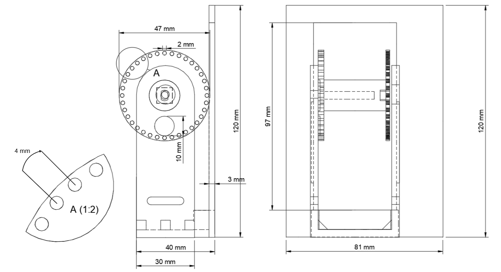
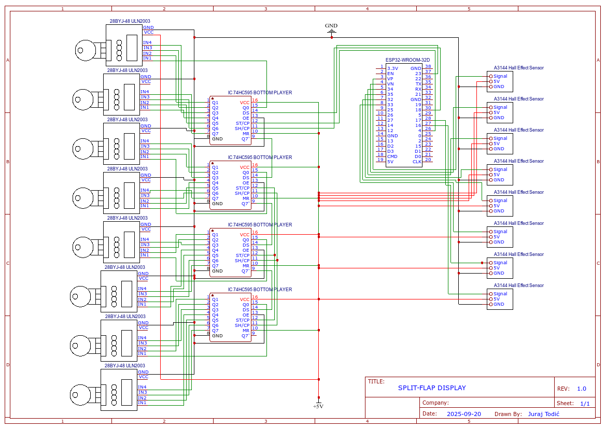

# ESP32 WiFi Controlled Split-Flap Display

This repository contains the complete technical documentation, 3D models, and firmware for a fully functional, 8-module electromechanical split-flap display. The entire system is controlled over Wi-Fi via a web interface hosted directly on the ESP32 microcontroller.

### Watch the Display in Action!

*(Here you can embed a GIF or link to a video of your project)*
`[Link to your demonstration video]`

## Project Overview

Inspired by the classic departure boards found in train stations and airports, this project recreates the iconic and satisfying "clatter" of a split-flap display in a compact, modern, and open-source package. The display has a dual-mode functionality: it can operate as a web-controlled message board or as an accurate, internet-synchronized clock.

The core engineering challenge was to create a reliable and precise positioning system for eight independent stepper motors without accumulating errors over time. This was solved using a closed-loop feedback mechanism with Hall effect sensors, all managed by a non-blocking state machine architecture in the firmware.

## Key Features

*   **8 Independent Modules:** An 8-character display capable of showing the full alphabet, numbers, and symbols.
*   **Wi-Fi Control:** Features a built-in web server hosted on the ESP32, allowing you to change messages and modes from any device on the network.
*   **Dual Mode Functionality:**
    *   **Word Mode:** Display any custom message up to 8 characters long.
    *   **Clock Mode:** Automatically fetches the current time from an NTP server and displays it in HH:MM:SS format.
*   **Auto-Calibration & Error Correction:** Each module uses a magnet and a Hall effect sensor to find a "home" position, preventing cumulative errors. The firmware also features an on-the-fly error correction mechanism that passively corrects for missed steps during operation.
*   **Non-Blocking Code:** The firmware is built on a state-machine model, allowing it to manage motor movements, serve the web page, and listen for commands simultaneously without delays.
*   **Fully Open Source:** All hardware schematics, 3D printable models, and source code are available here.

## How It Works

The system is a blend of mechanical design, custom electronics, and advanced firmware.

### Mechanical Design

The display is modular, with each of the eight character units being identical. The housing, rotor, and flaps were modeled in Tinkercad and are designed to be 3D printed. Precision is key to ensure the 36 flaps on each rotor can move freely without jamming.



### Electronics and Wiring

An ESP32-DevKitC serves as the brain of the project. Since the ESP32 lacks enough GPIO pins to directly control all eight stepper motors (requiring 32 lines), four **74HC595 shift registers** are used to expand the outputs. This allows all 32 motor control lines to be managed using just three ESP32 pins (DATA, CLOCK, LATCH).

Each module's feedback loop consists of a small neodymium magnet embedded in the rotor and an **A3144 Hall effect sensor** mounted to the frame. When the magnet passes the sensor, a signal is sent to the ESP32, marking a precise reference point.



### Software Breakdown

The firmware is developed in C++ using the PlatformIO IDE. The core logic is a **non-blocking state machine**. Instead of using `delay()` functions that would halt the processor, the main `loop()` runs thousands of times per second. In each cycle, it:
1.  Checks for incoming web clients.
2.  Updates the state of each of the eight motors (e.g., `IDLE`, `MOVING_TO_TARGET`, `RECALIBRATING`).
3.  Calculates the necessary motor steps based on trapezoidal speed profiles for smooth acceleration and deceleration.
4.  Sends the updated motor states as a single 32-bit pattern to the shift registers.

This approach ensures the device is always responsive to web commands, even while the motors are in motion.

## Getting Started

To build your own split-flap display, follow these steps.

### Prerequisites

*   All the hardware components listed in the technical report.
*   A 3D printer to create the mechanical parts.
*   Visual Studio Code with the **PlatformIO IDE** extension installed.

### Setup and Upload

1.  **Clone the repository:**
    ```sh
    git clone https://github.com/your-username/your-repo-name.git
    ```
2.  **Open the project** in Visual Studio Code. It should be automatically recognized as a PlatformIO project.
3.  **Configure Wi-Fi:** Open the `src/main.cpp` file and update the following lines with your network credentials:
    ```cpp
    const char* ssid = "YOUR_WIFI_SSID";
    const char* password = "YOUR_WIFI_PASSWORD";
    ```
4.  **Build and Upload:** Connect your ESP32 board to your computer and click the "Upload" button in the PlatformIO toolbar at the bottom of VS Code.
5.  **Find the IP Address:** After uploading, open the Serial Monitor. The ESP32 will print its IP address once it connects to your network.

### How to Use

1.  Open a web browser on any device connected to the same Wi-Fi network.
2.  Navigate to the IP address you found in the previous step.
3.  Use the web interface to switch between Word and Clock mode, or to enter a new message to display!

## Known Issues & Future Improvements

This prototype is fully functional but, as a first iteration, has clear areas for enhancement to improve its long-term reliability and ease of assembly.

*   **Firmware Edge Cases:** The state-driven, non-blocking firmware is highly efficient but can occasionally exhibit unpredictable behavior in rare edge cases (e.g., a web request arriving at the exact moment a motor state changes). If a module behaves erratically or gets stuck unexpectedly, a software fix should be considered. Investigating and reinforcing the state machine logic in the firmware should be the first step in debugging.
*   **Mechanical Tolerances:** The 3D printed parts have inherent tolerances that can lead to minor misalignments, which is the primary source of occasional display errors. A design with tighter tolerances would improve performance.
*   **Sensor Placement:** The manual placement of the Hall effect sensors is critical and highly sensitive. A revised 3D model with a fixed, non-adjustable mounting point for the sensors would greatly improve reliability and simplify the calibration process.

## Inspiration and Credits

This project was heavily inspired by the work of other makers in the open-source community.

A special thanks goes to **Scott Bezek** for his incredible [splitflap project](https://github.com/scottbez1/splitflap), which served as a foundational resource.

Additionally, I would like to credit **AudasWasTaken**. The 3D models in this project were originally based on the files from their [Split-Flap_Display repository](https://github.com/AudasWasTaken/Split-Flap_Display) and were then modified to fit the specific components and mechanics of this design.